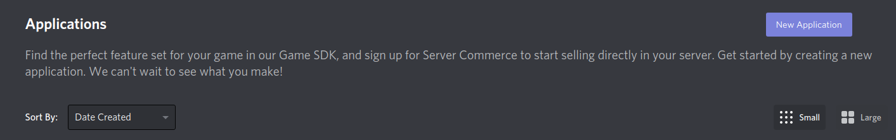
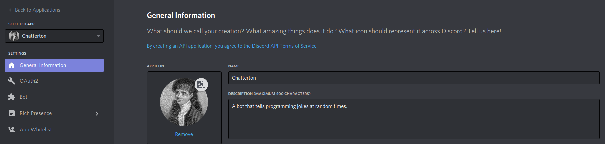
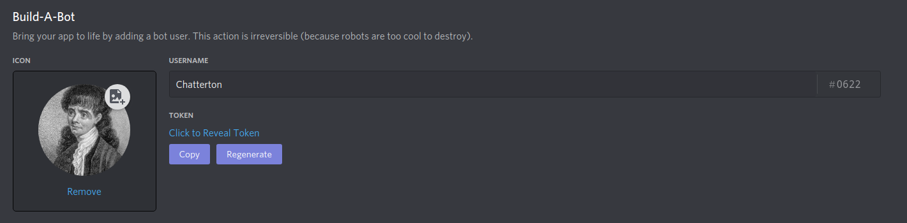

# Chatterton

A [Discord](https://discord.com) bot that tells jokes, provides `Apex Legends` player stats, tells random `Today In History` facts and that sends you a joke through PM whenever mentioned.

`Chatterton` is named after the poet [Thomas Chatterton](https://en.wikipedia.org/wiki/Thomas_Chatterton) whose appearace has been gracefully disguised with `ThugLife` glasses above.

## Available Commands

* `!stats`: Provides Apex Legends player stats. 
    * Usage: `!stats PLATFORM NICKNAME`. PLATFORM needs to be replaced by the platform. This can be either `origin`, `PSN` or `XBOX`. NICKNAME is the name of the of player.
* `!tih`: Short for `Today In History`. Gives you a historical fact for current date randomly selected from [here](http://history.muffinlabs.com/date).
* `!joke`: Tells you a joke! This was implemented by consuming the [JokeAPI](https://sv443.net/jokeapi/v2/).
* `!commands`: Does what I just did: tells you what are the available commands.

## Installation

`Chatterton` uses the `dotenv` gem in order to access Environment Variables for the required API key and Discord Token.

Follow the next steps to configure all that's needed:

- Download/clone this repo to your local machine
- Execute `touch .env` from the projects root directory
- Go to [Discord's Developer Portal](https://discord.com/developers/applications) to create a new App and click on the `New Application` purple button
    

- Give it a name once created click on `Bot` on the left column
    

- Now click on the Copy button
    

- On your `.env` file add your token like this
    - DISCORD_TOKEN=PLACE_TOKEN_HERE
- To get the Apex Legends Tracker API go here:
    - [Apex Tracker API](https://apex.tracker.gg/site-api). You need to create an account and get an API Key.
- Put that key on your `.env` file as follows:
    - APEX_API=PLACE_API_KEY_HERE
- Run `bundle install` from the project's root directory to install dependencies.
- Run `bundle exec bin/chatterton.rb'

## Author

**Josias Alvarado**

- GitHub: [@pointerish](https://github.com/pointerish)
- Twitter: [@pointerish](https://twitter.com/pointerish)
- LinkedIn: [Josias Alvarado](https://www.linkedin.com/in/josias-alvarado-80901878/)

## Built With

- 

##  Contributing

Contributions and issues are welcome!

## Show your support

Give a ⭐️ if you like this project!

## License

This project is [MIT](./LICENSE) licensed.

## Acknowledgements

- [Microverse](https://microverse.org)
- [The Apex Legends Tracker](https://apex.tracker.gg/site-api)
- [The Muffin Labs](http://history.muffinlabs.com)
- Ruby Community